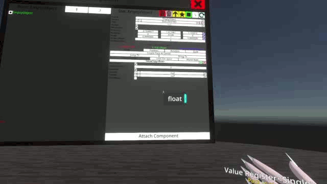

# A [NeosModLoader](https://github.com/zkxs/NeosModLoader) mod that adds reference proxies for the fields on LogiX registers.

This mod allows value/reference registers from LogiX to be dropped into inspector fields that can take whatever type they are.

